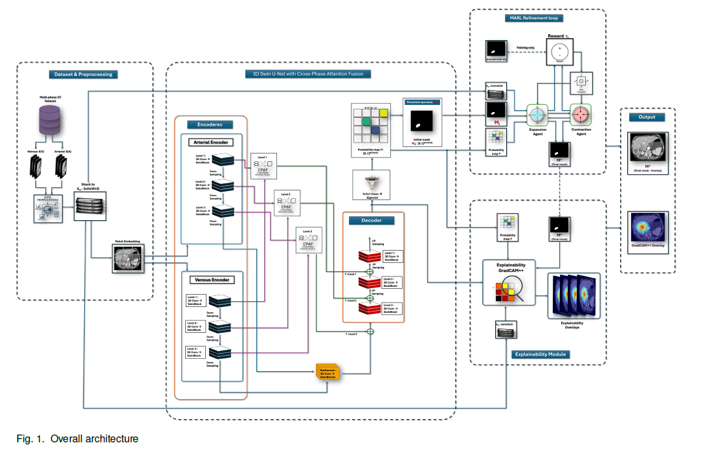

# Liver Multi‑Phase Segmentation with 3D Swin U‑Net, Cross‑Phase Attention & MARL

It includes:
- **Stage I**: 3D Swin U‑Net with **Cross‑Phase Attention Fusion (CPAF)** for initial tumor segmentation.
- **Stage II**: **Multi‑Agent Reinforcement Learning (MARL)** refinement (Expansion/Contraction agents, PPO, topology‑aware reward).
- **Stage III**: **Grad‑CAM++** explainability overlays.


# Liver Multi-Phase Segmentation with MARL Refinement



> Implementation of our proposed 3D Swin U-Net with Cross-Phase Attention Fusion, Multi-Agent RL refinement, and Grad-CAM++ explainability.


## Quickstart
```bash
# 0) Create environment
conda create -n liver-seg python=3.10 -y
conda activate liver-seg
pip install -r requirements.txt

# 1) Preprocess (resample 1mm³, HU clip [-200,300], z-norm, stack arterial+venous)
python scripts/preprocess.py --config configs/dataset_scidb.yaml

# 2) Build 3D patch indices (e.g., 128³)
python scripts/build_patches.py --config configs/dataset_scidb.yaml

# 3) Train Stage I: Swin U‑Net + CPAF
bash scripts/train_seg.sh  configs/train_seg.yaml  configs/model_swin_cpaf.yaml

# 4) Inference to get probability map P and initial mask M0
bash scripts/infer.sh      configs/infer.yaml  --ckpt checkpoints/swin_cpaf_xxx.pt

# 5) Train/Run Stage II: MARL refinement
bash scripts/train_rl.sh   configs/train_rl.yaml

# 6) Evaluate (Dice/HD95/topology)
python scripts/eval_metrics.py --pred_dir runs/preds --gt_dir data/raw/SCIDB

# 7) Explainability (Grad‑CAM++)
python scripts/make_cam_overlays.py --config configs/explainability.yaml   --ckpt checkpoints/swin_cpaf_xxx.pt --out overlays/
```

## Repo layout
See `docs/architecture.md` and folder comments for details.


---

## Baselines 


- **UNet3D** (classic 3D U-Net) → `configs/model_unet3d.yaml`
- **ResUNet3D** (3D residual U-Net) → `configs/model_resunet3d.yaml`
- **SwinUNet3D** (single-stream Swin U-Net) → `configs/model_swinunet3d.yaml`

**Train any baseline:**
```bash
bash scripts/train_baseline.sh unet3d configs/model_unet3d.yaml
bash scripts/train_baseline.sh resunet3d configs/model_resunet3d.yaml
bash scripts/train_baseline.sh swinunet3d configs/model_swinunet3d.yaml
```

**Infer any baseline:**
```bash
bash scripts/infer_baseline.sh unet3d configs/model_unet3d.yaml checkpoints/unet3d.pt
```
(see `docs/baselines.md` for the full list)
